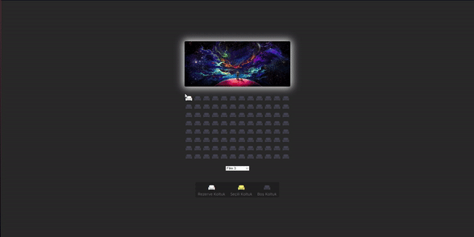

# Cinema Rezervation Site

I created a cinema rezervation site. In the design, I implemented the dynamics with JavaScript along with CSS. 

As seen in the design, there is a system where we can reserve seats. At the same time, ticket prices vary depending on the film.
Apart from these, since the selected seats are saved in local storage, we can still access the selected seats even if the page is refreshed.

<h2>Used Tech.</h2> 
<ul>
  <li>HTML was used.</li>
  <li>CSS was used in design.</li>
  <li>Javascript was used in dynamics.</li>
</ul>
<h2>Screen</h2>

